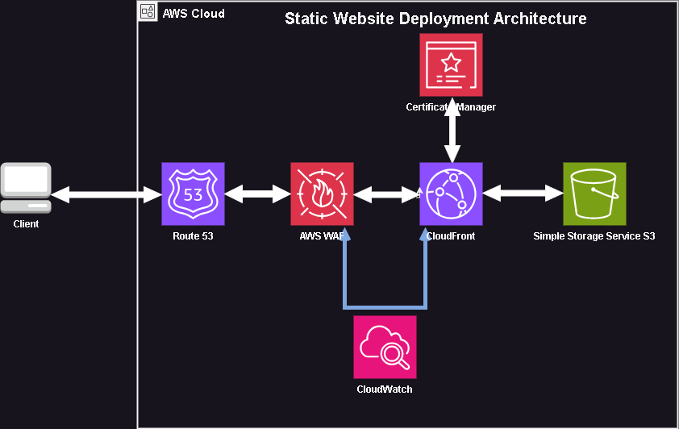

# 🚀 Secure Static Website Hosting on AWS with CloudFormation

This project demonstrates a secure, scalable, and highly available architecture for hosting a static website using AWS services. Built with the AWS Well-Architected Framework in mind, it automates deployment using an AWS CloudFormation template.

## 🧩 Architecture Overview

This solution includes:
- **Amazon S3** (static website hosting)
- **Amazon CloudFront** (global CDN)
- **AWS Certificate Manager (ACM)** (SSL/TLS for HTTPS)
- **AWS WAF** (web application firewall in monitor mode)
- **Amazon Route 53** (custom domain routing)
- **CloudFormation** (Infrastructure as Code)



## 🛡️ AWS Well-Architected Pillars Addressed

| Pillar | How It's Addressed |
|-------|---------------------|
| **Security** | S3 buckets are private by default. Only CloudFront (via OAC) can access content. WAF is deployed in monitor mode. HTTPS enforced via ACM. |
| **Reliability** | CloudFront provides global redundancy and failover. DNS via Route 53 ensures domain-level resilience. |
| **Performance Efficiency** | Content is cached at edge locations via CloudFront for fast delivery. |
| **Operational Excellence** | IaC enables repeatable, automated deployments. All resources are tagged. |
| **Cost Optimization** | Static hosting on S3 and caching via CloudFront provide a low-cost, high-performance alternative to traditional web hosting. |

## 🧠 Use Case

This architecture is ideal for:
- News/media startups
- Marketing websites
- Product landing pages
- Documentation sites
- Personal portfolios

## 📦 What's Included

- [CloudFormation Template](./static-website-cfn.yaml)
- WAF ruleset
- HTTPS support with a custom domain
- Private S3 bucket with Origin Access Control
- CloudFront distribution and DNS routing

## 🚀 How to Deploy

> **Prerequisites**
> - A registered domain in Route 53
> - AWS CLI configured
> - S3 bucket name prefix (must be globally unique)

```bash
aws cloudformation deploy \
  --template-file path/to/your-template.yaml \
  --stack-name static-website-stack \
  --capabilities CAPABILITY_NAMED_IAM \
  --parameter-overrides \
      DomainName=www.example.com \
      HostedZoneId=Z123456ABCDEFG \
      BucketNamePrefix=my-static-site
